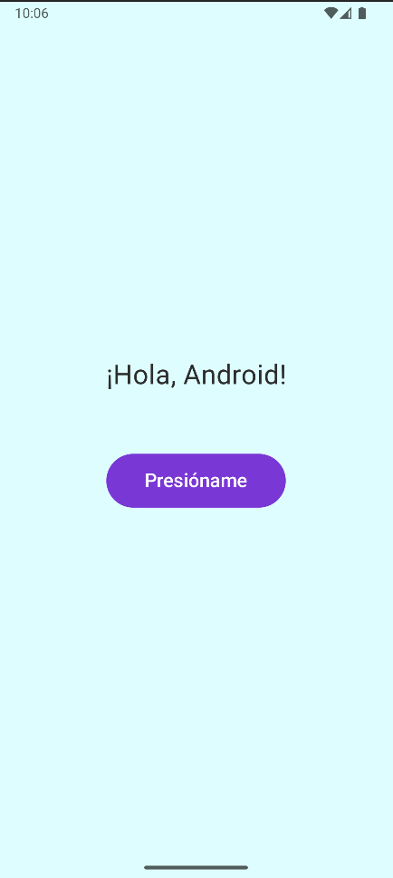
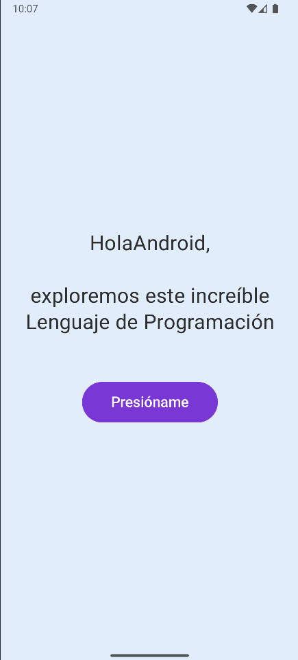
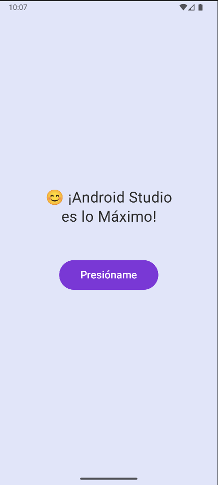

# HolaAndroidApp

Una aplicación Android simple y atractiva que demuestra el uso de Jetpack Compose con animaciones y transiciones.

## Capturas de Pantalla

<div align="center">
  
  
  
</div>

## Características

- Interfaz de usuario moderna con Jetpack Compose
- Animaciones suaves y transiciones de color de fondo
- Botón interactivo que cambia mensajes con animaciones
- Diseño responsive y atractivo visualmente

## Tecnologías utilizadas

- Kotlin
- Jetpack Compose
- Material Design 3
- Compose Animations

## Código Principal

Aquí está el código principal de la aplicación (`MainActivity.kt`):

```kotlin
@OptIn(ExperimentalAnimationApi::class)
@Composable
fun MainScreen() {
    var messageState by remember { mutableStateOf(0) }
    val messages = listOf(
        "¡Hola, Android!",
        "HolaAndroid,\n\nexploremos este increíble\nLenguaje de Programación",
        "😊 ¡Android Studio\nes lo Máximo!"
    )

    val backgroundColors = listOf(BackgroundColor1, BackgroundColor2, BackgroundColor3)
    val transition = rememberInfiniteTransition(label = "background")
    val colorTransition by transition.animateColor(
        initialValue = backgroundColors[0],
        targetValue = backgroundColors[2],
        animationSpec = infiniteRepeatable(
            animation = tween(3000),
            repeatMode = RepeatMode.Reverse
        ),
        label = "color"
    )

    Box(
        modifier = Modifier
            .fillMaxSize()
            .background(colorTransition),
        contentAlignment = Alignment.Center
    ) {
        Column(
            horizontalAlignment = Alignment.CenterHorizontally,
            verticalArrangement = Arrangement.Center,
            modifier = Modifier.padding(24.dp)
        ) {
            AnimatedContent(
                targetState = messageState,
                transitionSpec = {
                    slideInVertically { height -> height } + fadeIn() with
                    slideOutVertically { height -> -height } + fadeOut()
                },
                label = "message"
            ) { state ->
                Text(
                    text = messages[state],
                    fontSize = 28.sp,
                    textAlign = TextAlign.Center,
                    color = TextColor,
                    lineHeight = 36.sp,
                    modifier = Modifier.padding(bottom = 48.dp)
                )
            }
            
            Button(
                onClick = {
                    messageState = (messageState + 1) % messages.size
                },
                colors = ButtonDefaults.buttonColors(containerColor = ButtonPurple),
                modifier = Modifier
                    .padding(16.dp)
                    .animateContentSize()
            ) {
                Text(
                    "Presióname",
                    fontSize = 20.sp,
                    modifier = Modifier.padding(horizontal = 16.dp, vertical = 8.dp)
                )
            }
        }
    }
}
```

## Requisitos

- Android Studio Hedgehog | 2023.1.1 o superior
- SDK mínimo: Android 21 (Android 5.0)
- Kotlin 1.9.0 o superior

## Instalación

1. Clona este repositorio
2. Abre el proyecto en Android Studio
3. Sincroniza el proyecto con Gradle
4. Ejecuta la aplicación en un emulador o dispositivo físico

## Licencia

Este proyecto está bajo la Licencia MIT. Ver el archivo `LICENSE` para más detalles.
